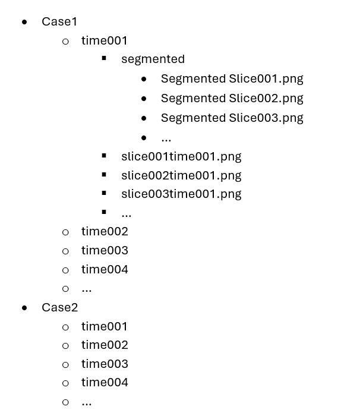

# SegmentationApp

SegmentationApp is a Python-based tool designed for performing image segmentation using advanced techniques like U-Net. This app allows for interactive segmentation, visualization, and analysis of images in real time.

## Features

- Multi-class image segmentation using U-Net architecture.
- Interactive UI for segmentation tasks.
- Real-time visualization of segmentation results.
- Support for images of varying dimensions.
- Customizable preprocessing and augmentation pipeline.
- Ability to toggle different layers and adjust segmentation settings.

## Installation

1. Clone the repository:
    ```bash
    git clone https://github.com/haziqshahard/SegmentationApp.git
    cd SegmentationApp
    ```

2. Install the required dependencies:
    ```bash
    pip install -r requirements.txt
    ```

## Usage

### Running the App
1. After installation, you can run the segmentation app using:
    ```bash
    python app.py
    ```

2.Images must be of the format:


3. Load your images via the UI and start the segmentation process.

### Example Usage

- **Step 1:** Load the image.
- **Step 2:** Adjust settings and perform segmentation.
- **Step 3:** View real-time results and save segmented output.

*Include video or GIF of segmentation in action*

## Customization

You can customize the following in `config.py`:
- Model architecture
- Loss functions
- Data augmentation techniques

## Datasets

- The app supports various image datasets. Ensure that your dataset is structured properly (e.g., different folders for training, validation, etc.).

- **Example Structure:**
