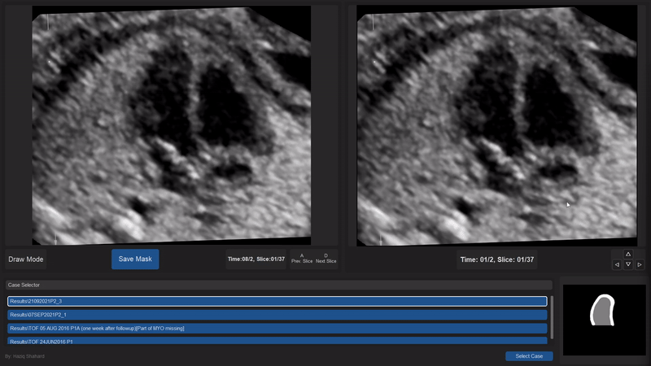

# SegmentationApp

SegmentationApp is a Python-based tool designed for performing image segmentation using advanced techniques like U-Net. This app allows for interactive segmentation, visualization, and analysis of images in real time.

## Features

- Myocardium and cavity manual segmentation using an interactive GUI.
- Real-time visualization of segmentation results.
- Customizable colors and options to enhance UX. 
- Ability to edit segmentations efficiently while viewing myocardium movements spatially and temporally.
- Ability to toggle different layers and adjust segmentation settings.
- Case selector for quick switching of cases, with saved progress and completion. 

## Datasets
- Ensure that your dataset is structured properly as shown below.

- **Example Structure:**
- Case1
    -time001
        -segmented
            -Segmented Slice001.png
            -Segmented Slice002.png
            -...
        -slice001time001.png
        -slice002time001.png
        -...
    -time002
    -...
-Case2
    -time001
    -time002
    -...

## Installation

1. Clone the repository:
    ```bash
    git clone https://github.com/haziqshahard/SegmentationApp.git
    cd SegmentationApp
    ```

2. Install the required dependencies:
    ```bash
    pip install -r requirements.txt
    ```

## Usage

### Running the App
1. After installation, you can run the segmentation app using:
    ```bash
    python app.py
    ```
2. Load your images via the UI and start the segmentation process by:
- Placing dots to create a fresh mask, which is then saved for the respective time. 
- Editing already existing masks to ensure fit
- Allocating cavity myocardium by holding down "c"
- Viewing ultrasound scans spatially and temporally to better understand myocardium positioning.

### Example Usage

- **Step 1:** Load the Case.
- **Step 2:** Adjust settings and perform segmentation.
- **Step 3:** View real-time results and save segmented output.



## Customization

You can customize the following:
- Dot, Line and Polygon Color
- Dot and Line size